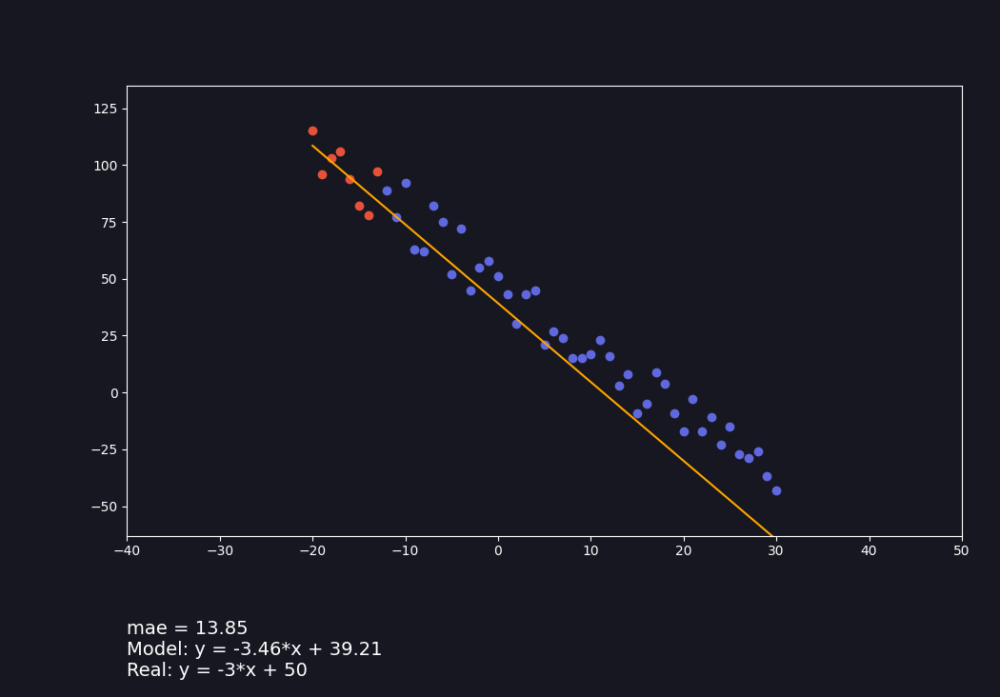

# Linear regression Demonstration

A visual demonstration of how the machine "learns" with a **linear regression** model using python and matplotlib.

You can see also a video that i've posted on linkedin about this project if you speak portuguese: [Linear Regression Demo Linkedin](https://www.linkedin.com/feed/update/urn:li:activity:7117924200786407425/) 

## Main Results
- Understood how a linear regression model works and how the model fits the data
- Learnt how to customize plots in matplotlib
- Created a function to generate data with a linear shape
- Calculated the accuracy of the model using **MAE** (mean absolute error)

## Installation

1. Clone the repository
2. Install required dependencies with 'pip install -r requirements.txt'
3. Run 'main.py'

